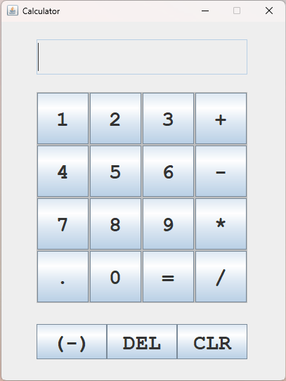

# Simple Calculator Application in Java

## Overview

This is a simple calculator application built using Java Swing. The calculator can perform basic arithmetic operations including addition, subtraction, multiplication, and division. It also supports decimal calculations, clearing the input, deleting the last input character, and changing the sign of the current input.

## Features

- Basic arithmetic operations: addition, subtraction, multiplication, and division
- Decimal point support
- Clear (CLR) button to reset the input
- Delete (DEL) button to remove the last character
- Negative (−) button to toggle the sign of the current input

## Screenshot

